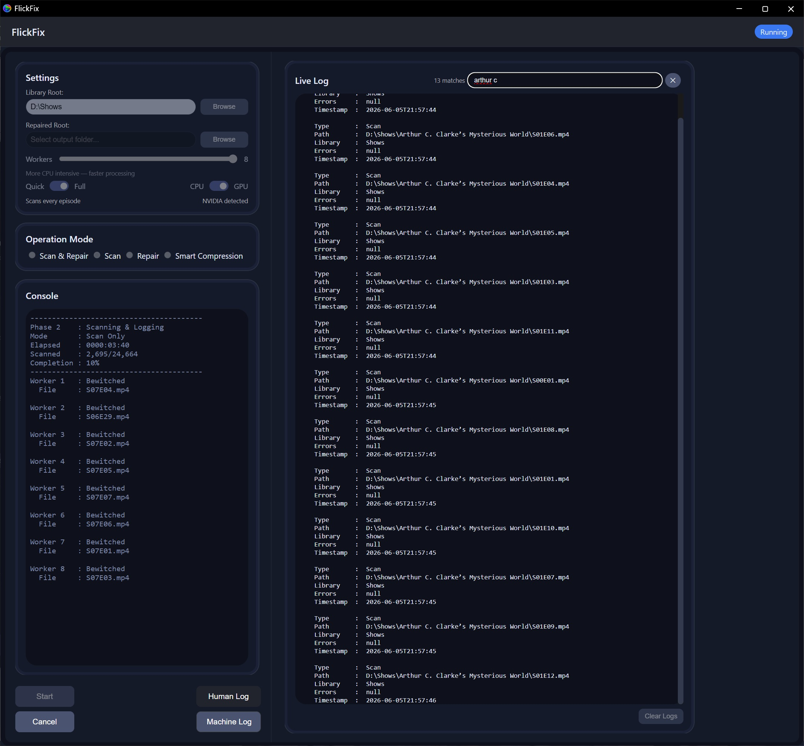
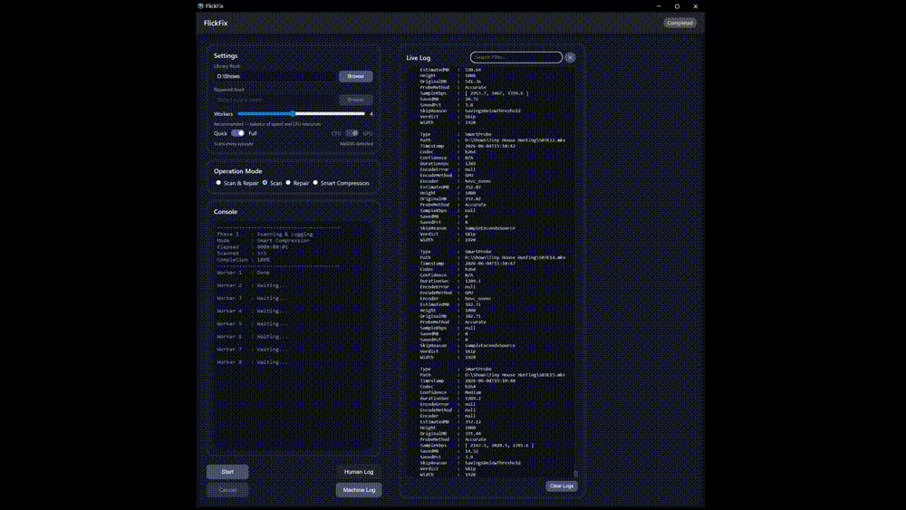
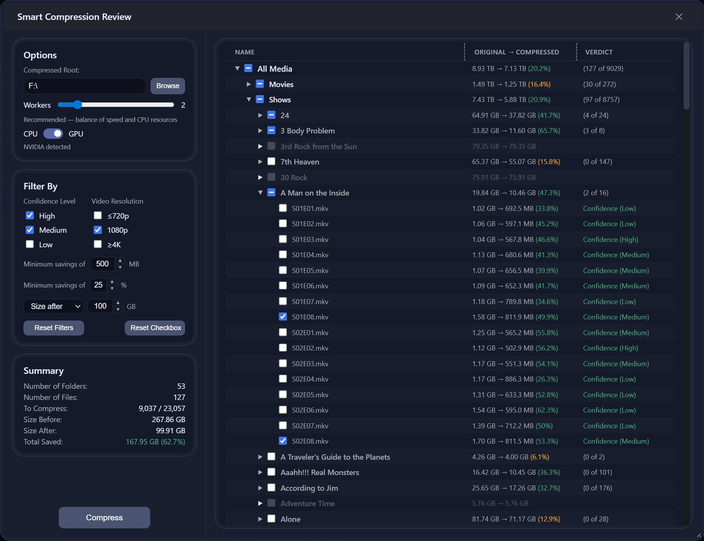
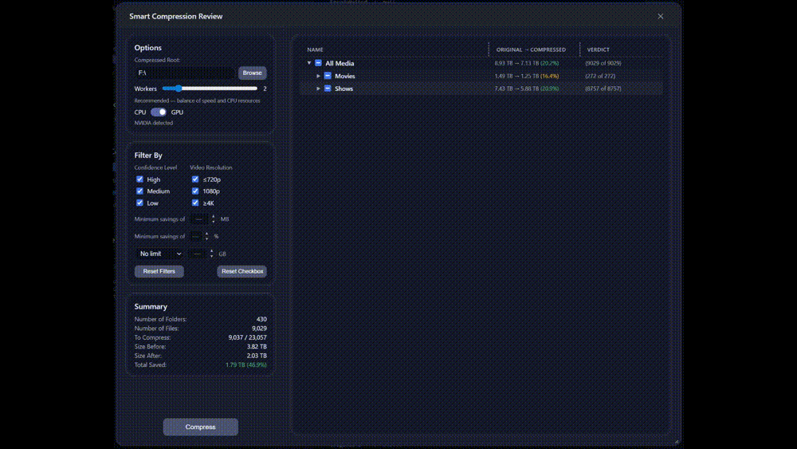
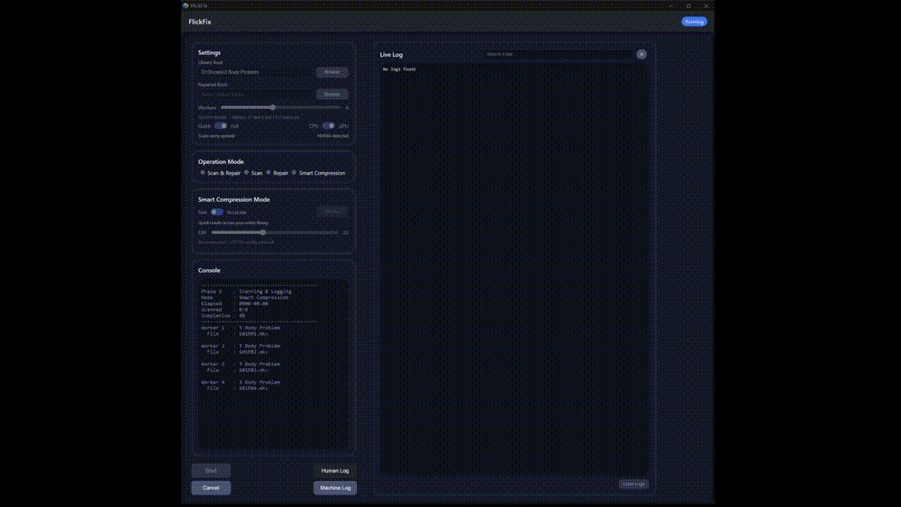

<div align="center">

# 🎬 FlickFix

**Stop babysitting your media library.** FlickFix scans, repairs, quality-checks, and smart-compresses your movie and TV collection automatically — no command line required.

[](https://github.com/captincrum/flick-fix/releases)
[](#installation-and-requirements)
[](#installation-and-requirements)
[](https://github.com/captincrum/flick-fix/stargazers)

<!--  -->

</div>

---

FlickFix is a full media-maintenance system built on PowerShell with a modern web-based GUI. It scans movie and TV libraries for corruption, repairs damaged files, evaluates quality, and intelligently compresses your library using FFmpeg and x265 — all from a clean interface in your browser.

Built for Plex and Jellyfin libraries, homelabs, and anyone who hoards more media than they can hand-manage.

> **Safe by design:** nothing is touched without your say-so. Scan-only mode makes zero changes, every compression run is previewed in a tree you approve before anything is written, disk space is checked first, and the whole pipeline is restart-safe.

---

## ✨ Features

### 🔍 Smart Library Scanning
- Detects corrupted or partially unreadable media files
- Identifies broken containers, codec issues, and structural problems
- Fast mode (first episode per season) or Full mode (every episode)
- Parallel worker scanning with configurable worker count
- Restart-safe logic — resumes where it left off on large libraries

<!-- -->

### 🛠️ Automated Repair Tools
- Attempts repair using multiple strategies in sequence
- Rebuilds containers, fixes metadata, and restores playable structure
- Logs every repair attempt in both human-readable and machine-readable formats

### 📊 Quality Analysis & Replacement Logic
- Evaluates video and audio quality against configurable thresholds
- Compares repaired files to originals
- Automatically replaces damaged sources only when quality criteria are met

### 🗜️ Smart Compression (x265)
- Probes your library with sample encodes to predict space savings **before** committing
- Fast mode: 1 sample per file (instant results across large libraries)
- Accurate mode: 3 samples per file (25%, 50%, 75%) for higher-confidence estimates
- Hard filters auto-skip files that are already HEVC/AV1/VP9, too short, too low bitrate, or would grow larger
- Confidence scoring (High / Medium / Low) based on sample variance
- Interactive results tree — expand shows, seasons, and files, then check/uncheck individual items before compressing
- Estimated savings shown per file, season, show, and library total
- Disk-space check before compression begins
- Parallel compression with separate worker-count control
- Restart-safe — skips already-completed files on resume

<!-- -->

<!-- -->

### 🖥️ Web-Based GUI
- Runs locally via a built-in PowerShell web server
- Clean dark interface accessible from any browser on the same machine
- Resizable live log panel with search/filter
- Human-readable and machine-readable log views with virtual scrolling for large logs
- Settings, operation mode, and compression options all in one view
- Cancel button terminates the pipeline and all child FFmpeg processes immediately

### 📜 Detailed Logging
- Human-readable log for quick review
- Structured JSON log for automation or dashboards
- Timestamped, ordered, and restart-safe
- Filterable live log with virtual windowing for performance on large libraries

---

## ⚙️ Operation Modes

Run any stage independently or as a full pipeline:

| Mode | Description |
| ----------------- | ------------------------------------------- |
| Scan & Repair | Full pipeline — scan, repair, and log |
| Scan Only | Detect issues without making changes |
| Repair Only | Attempt repairs on previously scanned files |
| Smart Compression | Probe and compress your library with x265 |

---

## 🔧 How It Works

### Scan & Repair
1. **Scan** — crawls your library and flags damaged or questionable files
2. **Repair** — attempts fixes via container rebuilds, stream extraction, or metadata correction
3. **Quality Check** — analyzes and compares the repaired file to the original
4. **Replace** — swaps in the repaired file only if it meets your quality requirements

### Smart Compression
1. **Probe** — runs sample encodes on each file to estimate compressed size and savings
2. **Review** — interactive tree shows estimated savings per file; uncheck anything you want to skip
3. **Compress** — parallel workers compress your selected files, writing live progress to the console

<!-- -->

---

## 📦 Installation & Requirements

**Requirements**
- Windows (PowerShell 5.1+)
- FFmpeg and FFprobe (must be in your system PATH)
- A modern browser (Chrome, Edge, Firefox)

**Install**
```bash
git clone https://github.com/captincrum/flick-fix.git
```

---

## 🚀 Usage

**1. Start the server**
Run `web/server.ps1` in PowerShell. This launches the local web server and opens the GUI in your browser.

**2. Configure settings**
- Set your Library Root path
- Set your Repaired Output path (for scan/repair modes)
- Choose Fast or Full scan mode
- Set worker count

**3. Choose an operation mode**
Select Scan & Repair, Scan, Repair, or Smart Compression.

**4. For Smart Compression**
- Choose Fast or Accurate probe mode
- Set your CRF value (22 recommended — ~97.5% quality retained)
- Click **Start** to probe your library
- Review estimated savings in the Compression Results tree
- Set your output location and compression worker count
- Click **Compress**

**5. Review logs**
Open the Human Log for a readable summary or the Machine Log for structured JSON. Use the search filter to find specific files or events.

---

## 🧩 Configuration

Settings are saved automatically to `config.json`:

| Setting | Description |
| --------------------- | ------------------------------------------ |
| RootPath | Path to your media library |
| RepairedPath | Output path for repaired files |
| Mode | Operation mode |
| ScanAllEpisodes | Fast (false) or Full (true) scan |
| AccurateMode | Fast (false) or Accurate (true) probe |
| CrfValue | x265 CRF quality value (18–28, default 22) |
| Workers | Parallel worker count for scanning/probing |
| CompressionOutputPath | Output path for compressed files |

---

## 🗺️ Roadmap

- [ ] GitHub Actions CI pipeline with automated test suite
- [ ] Playwright UI tests for button and console verification
- [ ] Plugin system for custom repair modules
- [ ] Optional CLI mode
- [ ] Cross-platform support

---

## 🤝 Contributing

Contributions, bug reports, and feature requests are welcome. Please open an [issue](https://github.com/captincrum/flick-fix/issues) or submit a pull request. See [CONTRIBUTING.md](CONTRIBUTING.md) for details.

---

If FlickFix saved you some drive space, consider leaving a ⭐ — it helps other people find it.