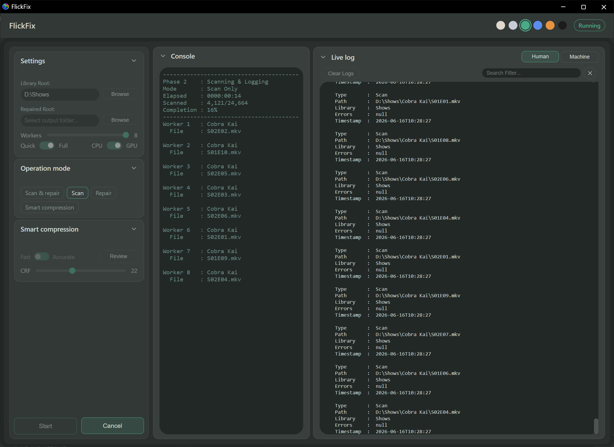
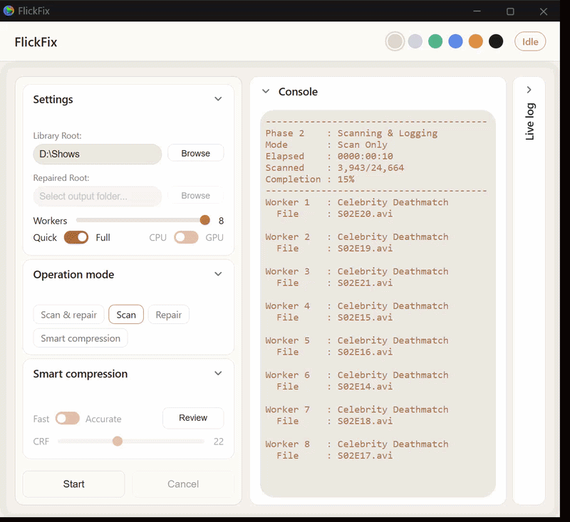
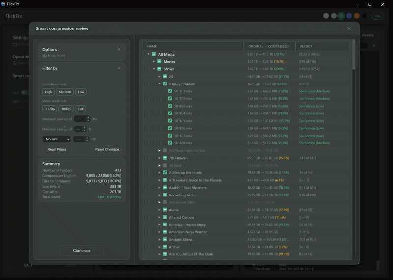
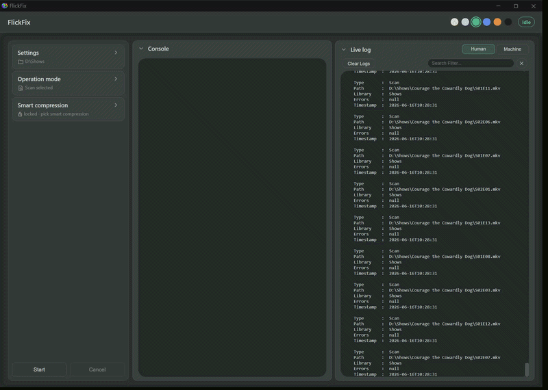

# FlickFix


**Automatically scan, repair, quality-check, and batch-compress your Plex or Jellyfin movie and TV library — with a clean web GUI, GPU-accelerated x265 (HEVC), and no command line required.**

FlickFix is a full media-maintenance system built on PowerShell with a modern web-based GUI. It scans Plex, Jellyfin, and Emby media libraries for corruption, repairs damaged video files, evaluates quality, and intelligently compresses your library with FFmpeg and x265 (HEVC) to reduce file size — including hardware-accelerated transcoding on NVIDIA, AMD, and Intel GPUs. Everything runs locally from a clean, themeable interface.



---

## Quick Start

```powershell
git clone https://github.com/captincrum/flick-fix.git
cd flick-fix
pwsh web/server.ps1   # or: powershell web/server.ps1 on Windows PowerShell 5.1
```

The GUI opens automatically in your default browser — no install, no console window. Point it at your library, pick a mode, and go.

---

## Features

### 🎨 Themeable, Collapsible Interface *(new in 2.8)*



- Six built-in color themes — True black, Warm slate, Sage, Slate grey, Warm white, and Light — switchable instantly from the header
- Every panel (Settings, Mode, Smart Compression, Filters, Console, Live Log) collapses and expands, with live summaries shown while collapsed
- Tip bubbles provide contextual help on every control
- Built on a CSS design-token system, so the whole UI re-themes in one click

### 🔍 Smart Library Scanning
- Detects corrupted or partially unreadable media files
- Identifies broken containers, codec issues, and structural problems
- Fast mode (first episode per season) or Full mode (every episode)
- Parallel worker scanning with configurable worker count
- Restart-safe — resumes where it left off on large libraries

### 🛠️ Automated Repair Tools
- Attempts repair using multiple strategies in sequence
- Rebuilds containers, fixes metadata, and restores playable structure
- Logs every repair attempt in both human-readable and machine-readable formats

### ✅ Quality Analysis and Replacement Logic
- Evaluates video and audio quality against configurable thresholds
- Compares repaired files to originals
- Automatically replaces damaged sources when quality criteria are met

### 🗜️ Smart Compression (x265 / HEVC)



- Probes your library using sample encodes to predict space savings **before** committing
- Fast mode: 1 sample per file (instant results across large libraries)
- Accurate mode: 3 samples per file (25%, 50%, 75%) for higher-confidence estimates
- **GPU acceleration:** auto-detects NVIDIA NVENC, AMD AMF, and Intel QSV, with a one-click CPU ↔ GPU toggle and a graceful CPU fallback
- Hard filters automatically skip files that are already HEVC/AV1/VP9, too short, too low bitrate, or would grow larger
- Confidence scoring (High / Medium / Low) based on sample variance
- Interactive Compression Review tree — expand shows, seasons, and files; check/uncheck before compressing
- **Filter & cap system:** narrow by confidence, resolution, minimum MB, or minimum % saved; cap a run by Top savers, Total saved, or target output size
- Sticky manual selections that survive filter and cap changes
- Estimated savings shown per file, season, show, and library total
- Disk-space check before compression begins
- Parallel compression with a separate worker count control
- Restart-safe — skips already-completed files on resume

### 🖥️ Live Console and Log Search



- Phase 1: Initialization status
- Phase 2 (Probe/Scan): Per-worker display showing folder, file, sample progress, and sample timer
- Phase 3 (Compress): Per-worker display showing folder, file, elapsed time, speed (MB/s), and estimated progress
- Phase 3 (Repair): Active repair details including attempt count, stage, and elapsed timers
- Overall completion percentage and elapsed session time

### 🌐 Web-Based GUI
- Runs locally via a built-in PowerShell web server (no install, no console window)
- Accessible from any browser on the same machine
- Resizable live log panel with search/filter and virtual scrolling
- Human-readable and machine-readable log views
- Cancel button terminates the pipeline and all child FFmpeg processes immediately

### 📋 Detailed Logging
- Human-readable log for quick review
- Structured JSON log for automation or dashboards
- Timestamped, ordered, and restart-safe
- Filterable live log with virtual windowing for performance on large libraries

---

## Operation Modes

| Mode | Description |
|---|---|
| Scan & Repair | Full pipeline — scan, repair, and log |
| Scan Only | Detect issues without making changes |
| Repair Only | Attempt repairs on previously scanned files |
| Smart Compression | Probe and compress your library with x265 (CPU or GPU) |

---

## How It Works

### Scan & Repair
1. **Scan Phase** — crawls your library and identifies damaged or questionable files
2. **Repair Phase** — attempts fixes using container rebuilds, stream extraction, or metadata correction
3. **Quality Check Phase** — analyzes and compares the repaired file to the original
4. **Replacement Phase** — replaces the original if the repaired file meets quality requirements

### Smart Compression
1. **Probe Phase** — runs sample encodes on each file to estimate compressed size and savings
2. **Review** — the interactive tree shows estimated savings per file; filter, cap, and uncheck anything you want to skip
3. **Compress Phase** — parallel workers compress selected files (CPU or GPU), writing live progress to the console

---

## Installation and Requirements

- Windows (PowerShell 5.1+)
- FFmpeg and FFprobe (must be in system PATH)
- A modern browser (Chrome, Edge, Firefox)
- Optional: an NVIDIA, AMD, or Intel GPU for hardware-accelerated encoding

Clone the repository:
```
git clone https://github.com/captincrum/flick-fix.git
```

---

## Usage

### 1. Start the Server
Run `web/server.ps1` in PowerShell. This starts the local web server and opens the GUI in your browser. The PowerShell console stays hidden.

### 2. Configure Settings
- Set your Library Root path
- Set your Repaired Output path (for scan/repair modes)
- Choose Fast or Full scan mode
- Set worker count and pick a theme

### 3. Choose an Operation Mode
Select from Scan & Repair, Scan, Repair, or Smart Compression.

### 4. For Smart Compression
- Choose Fast or Accurate probe mode
- Choose CPU or GPU encoding
- Set your CRF value (22 recommended — ~97.5% quality retained)
- Click Start to probe your library
- Review estimated savings in the Compression Review tree; apply filters or a cap
- Set your output location and compression worker count
- Click Compress

### 5. Review Logs
Open the Human Log for a readable summary or the Machine Log for structured JSON. Use the search filter to find specific files or events.

---

## Configuration

Settings are saved automatically to `config.json`:

| Setting | Description |
|---|---|
| RootPath | Path to your media library |
| RepairedPath | Output path for repaired files |
| Mode | Operation mode |
| ScanAllEpisodes | Fast (false) or Full (true) scan |
| AccurateMode | Fast (false) or Accurate (true) probe |
| CrfValue | x265 CRF quality value (18–28, default 22) |
| Workers | Parallel worker count for scanning/probing |
| UseGPU | Use hardware encoder when available (true/false) |
| CompressionOutputPath | Output path for compressed files |

---

## Testing

- **175** PowerShell unit tests across 18 suites
- **188** Playwright UI tests across 22 suites
- Run via `Tests/Run-Tests.ps1` (unit) and Playwright (`npm test`)

---

## Roadmap

- Plugin system for custom repair modules
- Optional CLI mode
- Cross-platform support

---

## Contributing

Contributions, bug reports, and feature requests are welcome. Please open an issue or submit a pull request.